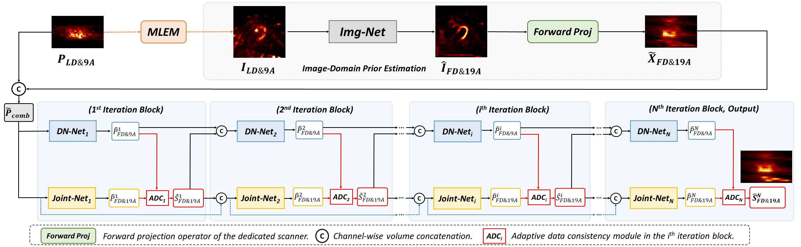
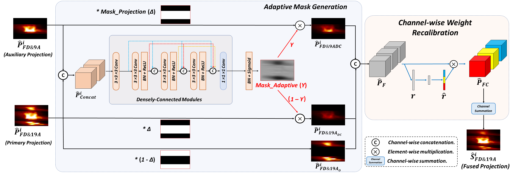

# Joint_Denoising_FewAngle Dual-domain Iterative Network with Adaptive Data Consistency for Joint Denoising and Few-angle Reconstruction of Low-dose Cardiac SPECT

Xiongchao Chen, Bo Zhou, Huidong Xie, Xueqi Guo, Qiong Liu, Albert J. Sinusas, Chi Liu

[[Paper Link](https://arxiv.org/abs/2305.10328)]

